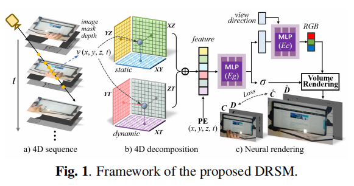

# DRSM: EFFICIENT NEURAL 4D DECOMPOSITION FOR DYNAMIC RECONSTRUCTION IN STATIONARY MONOCULAR CAMERAS
This is the code for DRSM, a novel framework a novel neural 4D decomposition for dynamic reconstruction from single-view videos to tackle 4D decomposition problem for dynamic scenes in monocular cameras.
<div align=center>

</div>
[

## Prerequisities
Our model is trained and tested under:
* tiny-cuda-nn
* jax
* tensorboard
* open3d
* tqdm
* torch-cuda
* pillow
* opencv-python
* pandas
* lpips
* torchmetrics
* scikit-image
* imageio
* nerfacc
* pytorch-msssim

## Dataset
We use a self-built dataset for training. If there is a need please contact xwxxmu@gmail.com.

## Train
Set data root in code. Then run:
```bash
python drsm/main.py --config-path drsm/configs/icassp/Drsm/full_5000_boxs.py
```

## Recontruct_pointclouds
Operation for reconstructing point clouds:
```bash
python recontruct_pointclouds.py --root_path ./logs/icassp/10k_boxs/estm --out_postfix lp_recon --depth_smoother
```

## Acknowledgements
We would like to acknowledge the following inspiring work:
* K-Planes  (Fridovich-Keil et al.)
* HexPlane (Ang-Cao et al.)
* Tensor4D(Ruizhi-Shao et al.)

